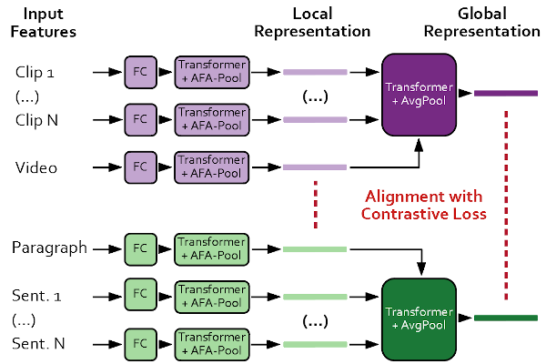

# COOT: Cooperative Hierarchical Transformer for Video-Text Representation Learning

**2021-01-31** (v0.3.3): We publish our Video Captioning code.

**2020-12-31** (v0.2.6):  We release our Deep-Learning Research Framework as open-source to contribute to the DL / CV community. [nntrainer library documentation](nntrainer/README.md)

**2020-10-22** (v0.1): This repository is the official PyTorch implementation of our [paper](https://arxiv.org/abs/2011.00597) published at NeurIPS 2020 ([slides](assets/slides_coot.pdf), [poster](assets/poster_coot.pdf), [poster session](https://neurips.cc/virtual/2020/protected/poster_ff0abbcc0227c9124a804b084d161a2d.html))

 Test coverage: **28%**

## Table of Contents

* [Table of Contents](#table-of-contents)
* [Features](#features)
* [Installation](#installation)
* [Prepare datasets for Video Retrieval](#prepare-datasets-for-video-retrieval)
  * [Precompute all the text features](#precompute-all-the-text-features)
  * [Download and extract video data](#download-and-extract-video-data)
* [Prepare pretrained models / embeddings](#prepare-pretrained-models--embeddings)
* [Train and validate Video Retrieval](#train-and-validate-video-retrieval)
  * [Useful script flags](#useful-script-flags)
  * [Show training results](#show-training-results)
  * [Advanced usage](#advanced-usage)
* [Extract your own embeddings](#extract-your-own-embeddings)
  * [Working with the embeddings](#working-with-the-embeddings)
* [Video Captioning with the MART model](#video-captioning-with-the-mart-model)
  * [Setup](#setup)
  * [Train and validate MART on COOT embeddings](#train-and-validate-mart-on-coot-embeddings)
  * [Setup data for original MART (trained on video features)](#setup-data-for-original-mart-trained-on-video-features)
  * [Train MART on your own computed embeddings](#train-mart-on-your-own-computed-embeddings)
  * [Rebuild MART cache](#rebuild-mart-cache)
* [Troubleshooting](#troubleshooting)
  * [Training / inference crashes](#training--inference-crashes)
  * [Java meteor metric is crashing](#java-meteor-metric-is-crashing)
  * [Downloading Torrents](#downloading-torrents)
* [Model Outline (Retrieval)](#model-outline-retrieval)
* [Acknowledgements](#acknowledgements)
* [License](#license)
* [Citation](#citation)

## Features

- Reproduce inference / training results on Video-Text Retrieval for models in tables 2 and 3 of the paper.
- **New:** We provide the COOT output representations for downstream tasks and utility code to extract those features yourself.
- Captioning code **not yet included, to be released around 8th Jan 2021** (tables 4 and 5 of the paper)
- Please note there is *no backwards compatibility* to the original nips submission code. Find the old code in branch  `version-0.1`

## Installation

We use `python=3.8.5` and `pytorch=1.7.1`. Tested on `Windows 10` and `Ubuntu 18.04`.

~~~bash
git clone https://github.com/gingsi/coot-videotext
cd coot-videotext
pip install -r requirements.txt
~~~

## Prepare datasets for Video Retrieval

The default datasets folder is `data/`. To use a different folder, supply all scripts with flag `--data_path /new/path` or change `repo_config.py`. On linux you could also make a link: `ln -s /new/path data`.

### Precompute all the text features

~~~bash
python data_read_activitynet_meta.py
python data_read_youcook2_meta.py
python precompute_text.py activitynet --cuda
python precompute_text.py youcook2 --cuda
~~~

### Download and extract video data

**ActivityNet Captions:** [Download Torrent](https://academictorrents.com/details/0c824440c94cc18ace1cb2c77423919b728d703e)  ~52GB, please seed. [Mirror Google Drive](https://drive.google.com/file/d/1Gir-cRLhVpqjyADq55r5VF9Cs9YdOOz9/view?usp=sharing)

~~~bash
# download features to data/activitynet/ and extract to
# data/activitynet/features/ICEP_V3_global_pool_skip_8_direct_resize/v_XXXXXXXXXXX.npz
tar -C data/activitynet/features -xvzf data/activitynet/ICEP_V3_global_pool_skip_8_direct_resize.tar.gz
~~~

**Youcook2 with ImageNet/Kinetics Features:** [Download Torrent](https://academictorrents.com/details/3ae97c261ed32d3bd5326d3bf6991c9e2ea3dc17) ~13GB, please seed. [Mirror Google Drive](https://drive.google.com/file/d/1q7QocJq3mDJU0VxqJRZhSbqdtPerC4PS/view?usp=sharing) 

~~~bash
# download features to data/youcook2/ and extract to data/youcook2/video_feat_2d3d.h5
tar -C data/youcook2 -xzvf data/youcook2/video_feat_2d3d.tar.gz
~~~

**Youcook2 with Howto100m features:** [Download Torrent](https://academictorrents.com/details/70417e3793dbbb03ca68981307860254766d5a1d) ~630MB, please seed. [Mirror Google Drive](https://drive.google.com/file/d/1oWSg7mvZE2kP_Ig4-OdNjRPAMqDghwag/view?usp=sharing)

~~~bash
# download features and extract to data/youcook2/video_feat_100m.h5
tar -C data/youcook2 -xzvf data/youcook2/video_feat_100m.tar.gz
~~~

## Prepare pretrained models / embeddings

**Models:** [Download Link](https://drive.google.com/file/d/1JPN8v3sz4rRvqo5CB76lrOdCh6kSDkg4/view?usp=sharing) ~100mb, **Embeddings:** [Download Link](https://drive.google.com/file/d/1atbI9HaFArNPeZzkvrJ9TnkCAal6gyUQ/view?usp=sharing) ~230mb

~~~bash
tar -xzvf provided_models.tar.gz
tar -xzvf provided_embeddings.tar.gz
# after extraction, the folder structure should look like this:
 **Embeddings:** [Download Link](https://drive.google.com/file/d/1atbI9HaFArNPeZzkvrJ9TnkCAal6gyUQ/view?usp=sharing) ~230mb
# provided_models/MODEL_NAME.pth and provided_embeddings/EMBEDDING_NAME.pth
~~~

## Train and validate Video Retrieval

Results are in `experiments/` folder. Training info: LR reduced on plateau. Early stopping after 16 bad epochs. No fixed seeds!

~~~bash
# ### Table 2: Video-paragraph retrieval results on AcitvityNet-captions dataset (val1).
python train_retrieval.py -c config/retrieval/paper2020/anet_coot.yaml
python train_retrieval.py -c config/retrieval/paper2020/anet_coot.yaml --load_model provided_models/anet_coot.pth --validate
python test_embeddings_retrieval.py provided_embeddings/anet_coot_val.h5
# ### Table 3: Retrieval Results on Youcook2 dataset
# 2d3d: model with ResNet/ResNext features
python train_retrieval.py -c config/retrieval/paper2020/yc2_2d3d_coot.yaml
python train_retrieval.py -c config/retrieval/paper2020/yc2_2d3d_coot.yaml --load_model provided_models/yc2_2d3d_coot.pth --validate
python test_embeddings_retrieval.py provided_embeddings/yc2_2d3d_coot_val.h5
# 100m: model with HowTo100m features
python train_retrieval.py -c config/retrieval/paper2020/yc2_100m_coot.yaml
python train_retrieval.py -c config/retrieval/paper2020/yc2_100m_coot.yaml --load_model provided_models/yc2_100m_coot.pth --validate
python test_embeddings_retrieval.py provided_embeddings/yc2_100m_coot_val.h5
~~~

###  Useful script flags

~~~bash
--preload    # preload video features to RAM (activitynet ~110GB, youcook2 resnet/resnext 60GB, howto100m 20GB)
--workers N  # Change number of parallel dataloader workers, default 4
--no_cuda    # Disable CUDA completely.
--single_gpu # Disable using multiple GPUs with nn.DataParallel.
--help       # See all command line options.
-q / -v      # Less / more output.
--num_runs X # Train multiple runs
~~~

### Show training results

~~~bash
# Show provided experiment results.
python show_retrieval.py --log_dir provided_experiments --mean --compact
# Output:
# experiment (num) |       v2p-r1|       p2v-r1|       c2s-r1|       s2c-r1|  time
# -----------------|-------------|-------------|-------------|-------------|----------
# anet_coot_run (3)|61.44% ±0.94%|61.56% ±0.82%| 0.00% ±0.00%| 0.00% ±0.00%|0.90 ±0.23
# yc2_100m_run (3) |75.35% ±2.67%|73.96% ±2.09%|15.47% ±0.04%|16.64% ±0.19%|0.20 ±0.02
# yc2_2d3d_run (3) |48.72% ±1.03%|47.63% ±1.42%| 5.53% ±0.17%| 5.97% ±0.21%|1.45 ±0.41

# Show your own results after training
python show_retrieval.py
~~~

### Advanced usage

To group your experiments for organization, provide the experiment identifier. Results will be stored in `experiments/retrieval/paper2020/yc2_100m_coot_myrun1/`

~~~bash
# Instead of giving the path to the config file like this
python train_retrieval.py -c config/retrieval/paper2020/yc2_100m_coot.yaml --run_name myrun
# Set experiment group and name
python train_retrieval.py --exp_group paper2020 --exp_name yc2_100m_coot --run_name myrun
# Or in short
python train_retrieval.py -g paper2020 -e yc2_100m_coot -r myrun
~~~

## Extract your own embeddings

~~~bash
# ### Extract YouCook2: HowTo100M embeddings
python train_retrieval.py -g paper2020 -e yc2_100m_coot -r valset --load_model provided_models/yc2_100m_coot.pth --reset --validate --save_embeddings
python train_retrieval.py -g paper2020 -e yc2_100m_coot -r trainset --load_model provided_models/yc2_100m_coot.pth --reset --validate --save_embeddings -o dataset_val.split=train

# compute retrieval on validation and train embeddings
python test_embeddings_retrieval.py experiments/retrieval/paper2020/yc2_100m_coot_valset1/embeddings/embeddings_0.h5
python test_embeddings_retrieval.py experiments/retrieval/paper2020/yc2_100m_coot_trainset1/embeddings/embeddings_0.h5

# ### Extract YouCook2: ResNet / ResNeXt embeddings
python train_retrieval.py -g paper2020 -e yc2_2d3d_coot -r valset --load_model provided_models/yc2_2d3d_coot.pth --reset --validate --save_embeddings
python train_retrieval.py -g paper2020 -e yc2_2d3d_coot -r trainset --load_model provided_models/yc2_2d3d_coot.pth --reset --validate --save_embeddings -o dataset_val.split=train

# ### Extract ActivityNet features
python train_retrieval.py -g paper2020 -e anet_coot -r valset --load_model provided_models/anet_coot.pth --reset --validate --save_embeddings
python train_retrieval.py -g paper2020 -e anet_coot -r trainset --load_model provided_models/anet_coot.pth --reset --validate --save_embeddings -o dataset_val.split=train

~~~

### Working with the embeddings

Note that the datapoint IDs in `key` need to be decoded before using with `key.decode("utf8")`.

High level embeddings (Video and Paragraph level) are saved in `vid_emb` and `par_emb`. `key` will give you the string ID of the datapoint. Information about the datapoint (text, hierarchy) are saved in `data/${DATASET}/meta_all.json`.

~~~bash
# Load the embeddings file with h5py and decide which items you need.
import h5py
h5 = h5py.File("provided_embeddings/anet_coot.h5", "r")
h5.keys()
# Output: ['clip_emb', 'clip_emb_before_norm', 'clip_num', 'key', 'par_context', 'par_context_before_norm', 'par_emb', 'par_emb_before_norm', 'sent_emb', 'sent_emb_before_norm', 'sent_num', 'vid_context', 'vid_context_before_norm', 'vid_emb', 'vid_emb_before_norm']
~~~

To assign the low level embeddings (Clip and sentence level) in `clip_emb` and `sent_emb` to the respective video, you need a little math. The number of clips per video is stored in `clip_num`. The following code snippet shows how to get the clip embeddings given the video number.

~~~python
import numpy as np
clip_num = h5["clip_num"]
clip_end = np.cumsum(clip_num)
clip_start = clip_end - clip_num
i = 7  # for example get the 7th video of all validation videos in activitynet
clip_embeddings = h5["clip_emb"][clip_start[i]:clip_end[i]]
clip_embeddings.shape  # clip embeddings with shape (4, 384)
clip_num[i]  # 4 clips in this video

# to get the video number given a key, invert the index
key_to_idx = dict([key.decode("utf8"), i] for i, key in enumerate(h5["key"]))
key_to_idx["--1DO2V4K74_val_1"]
# Output: 0
~~~

We also provide the global context embeddings which are used in our Contextual Transformer. There, the local embeddings are pooled to the final output and a cross-attention layer inputs the information from the global context (see the paper). We also provide the unnormalized version for all the embeddings (before using L2-Norm).

## Video Captioning with the MART model

Note: Training is not seeded and the captioning metrics are volatile, train the models several times to get high confidence of the performance.

### Setup

1. Make sure you installed the updated requirements with `pip install -r requirements.txt`
1. If you have problems with the `pycocoevalcap` package try uninstalling it and installing it with this command instead: `pip install git+https://github.com/salaniz/pycocoevalcap`
1. The METEOR metric requires `java`. Either install the latest Java 1.8 through the system (Tested with `Java RE 1.8.0_261`) or install with conda `conda install openjdk`. Make sure your locale is set correct i.e. `echo $LANG` outputs `en_US.UTF-8`
1. Download and extract: [COOT output Embeddings](https://drive.google.com/file/d/1atbI9HaFArNPeZzkvrJ9TnkCAal6gyUQ/view?usp=sharing) ~230mb, [Pretrained Captioning models](https://drive.google.com/file/d/1IV85_DXWx1SJL9ZJuT6Qvvyx8obE9f9x/view?usp=sharing) ~540 mb
1. To reproduce the original MART results, you will need the input features, see next chapter for setup.

~~~bash
tar -xzvf provided_embeddings.tar.gz
tar -xzvf provided_models_caption.tar.gz
~~~

### Train and validate MART on COOT embeddings

**Note:** Evaluation during training uses exponential moving averages by default and two models are saved each epoch (normal weights and EMA weights). The Captioning models we provide are normal weights (and not EMA weights).

~~~bash
# ### YouCook2
# Train MART on COOT video+clip embeddings (table 4 row 10)
python train_caption.py -c config/caption/paper2020/yc2_100m_coot_vidclip_mart.yaml
# Train MART on COOT clip embeddings (table 4 row 6)
python train_caption.py -c config/caption/paper2020/yc2_100m_coot_clip_mart.yaml
# Train MART on COOT clip embeddings, retrieval trained on 2D/3D features (table 4 row 5)
python train_caption.py -c config/caption/paper2020/yc2_2d3d_coot_vidclip_mart.yaml
# Train original MART (table 4 row 3)
python train_caption.py -c config/caption/paper2020/yc2_mart.yaml

# ### ActivityNet
# Train MART on COOT video+clip embeddings (table 5 row 9)
python train_caption.py -c config/mart/paper2020/anet_coot_vidclip_mart.yaml
# Train original MART (table 5 row 3)
python train_caption.py -c config/mart/paper2020/anet_mart.yaml

# show trained results
python show_caption.py -m base

# evaluate provided models
python train_caption.py -c config/caption/paper2020/yc2_100m_coot_vidclip_mart.yaml --validate --load_model provided_models_caption/yc2_100m_coot_vidclip_mart.pth
# etc.
~~~

Modify the configurations to train on the other models and features (Table 4 rows 4-9 and Table 5 rows 4-8). These models are not extensively tested

- Vanilla Transformer: `recurrent:false`, `mtrans:true`, `max_v_len:1`
- MART without recurrence: `recurrent:false`
- TransformerXL `xl:true` optionally with gradient `xl_grad:true`

### Setup data for original MART (trained on video features)

You can reproduce the original [MART](https://github.com/jayleicn/recurrent-transformer) results with our code. The captioning model is trained conditionally on extracted video appearance and optical flow features instead of COOT embeddings.

Download features from Google Drive: [rt_anet_feat.tar.gz (39GB)](https://drive.google.com/file/d/1mbTmMOFWcO30PIcuSpYiZ1rqoy5ltE3A/view?usp=sharing) and [rt_yc2_feat.tar.gz (12GB)](https://drive.google.com/file/d/1mj76DwNexFCYovUt8BREeHccQn_z_By9/view?usp=sharing). These features are repacked from features provided by [densecap](https://github.com/salesforce/densecap#annotation-and-feature). Extract the features such that they can be found in `data/mart_video_feature/activitynet/*.npy` and `data/mart_video_feature/youcook2/*.npy` respectively.

The following extraction code expects the downloaded `.tar.gz` files in the repository's root.

~~~bash
# Prepare youcook2 video features
mkdir -p data/mart_video_feature/youcook2
tar -xvzf rt_yc2_feat.tar.gz -C data/mart_video_feature/youcook2
mv data/mart_video_feature/youcook2/rt_yc2_feat/trainval/*.npy data/mart_video_feature/youcook2
rm -r data/mart_video_feature/youcook2/rt_yc2_feat

# Prepare activitynet video features
mkdir -p data/mart_video_feature/activitynet
tar -xvzf rt_anet_feat.tar.gz -C data/mart_video_feature/activitynet
mv data/mart_video_feature/activitynet/rt_anet_feat/trainval/*.npy data/mart_video_feature/activitynet
rm -r data/mart_video_feature/activitynet/rt_anet_feat
~~~

Run the training once the features are prepared:

### Train MART on your own computed embeddings

Assuming you have run the YouCook2 example in chapter "Extract your own embeddings", you should be able to run the captioning experiments on these embeddings and get the same results as with the provided embeddings.

Modify field `coot_model_name` in the configuration to `yc2_100m_coot_extracted` or alternatively use the flag `-o coot_model_name=yc2_100m_coot_extracted`

~~~bash
# move the extracted embeddings from experiments/ folder to a new folder embeddings/
mkdir -p embeddings
mv experiments/retrieval/paper2020/yc2_100m_coot_valset1/embeddings/embeddings_0.h5 embeddings/yc2_100m_coot_extracted_val.h5
mv experiments/retrieval/paper2020/yc2_100m_coot_trainset1/embeddings/embeddings_0.h5 embeddings/yc2_100m_coot_extracted_train.h5

# modify the configuration file 
# run experiment for table 4 row 10 again but with the new embeddings instead
python -m train_mart -c config/mart/paper2020/anet_coot_vidclip_mart.yaml --coot_feat_dir embeddings
~~~

Note that if you have designed your own COOT with different embedding dimensions you have to give the new dimensions to the captioning training script: `--coot_dim_vid DIMVID` (default 768)  `--coot_dim_clip DIMCLIP` (default 384). Depending on which `--coot_mode MODE` you use update the video feature size: `--video_feature_size X`. Mode `vidclip`: `X = DIMVID + DIMCLIP` (default 1152), mode `clip`: `X = DIMCLIP` (default 384), mode `vidclipctx`: `X = DIMVID + 2 * DIMCLIP` (default 1536), mode `vid`: `X = DIMVID` (default 768)

### Rebuild MART cache

Download [glove]( http://nlp.stanford.edu/data/glove.6B.zip) extract file  `pretrained_models/glove.6B.300d.txt` run `python mart_build_vocab.py youcook2` and
`python mart_build_vocab.py activitynet`

## Troubleshooting

### Training / inference crashes

Try the following steps to debug problems with the code:

Update GPU drivers / PyTorch version / Check if CUDA works correctly. Set `--workers 0` to disable multiprocessing. Change the `config.yaml` you are loading at the end of the file: `cudnn_benchmark: false`, `cudnn_deterministic: true`, `fp16_train: false`, `fp16_val: false`. Try training on the CPU by setting `use_cuda: false`, `use_multi_gpu: false` in the config.

Preloading features is disabled by default. If you enable it and get "OSError: Too many open files", you have to increase the open file limit e.g. by running `ulimit -n 100000`. You can disable it with `--no_preload`.

### Java meteor metric is crashing

Run `python meteor_test.py` to reproduce the problem. Run `java -version` to see your java version. Install `java JRE 1.8.0_281` or greater if you are admin. Alternatively run `conda install openjdk` to install java into your conda environment.

Make sure the locale in the system is correct. `echo $LANG` should output `en_US.UTF-8`. Run `locale -a` to see if this language is installed. If not, install it. Run `export LANG="en_US.UTF-8"` and test meteor again. To change the language permanently, edit the `/etc/default/locale` file or alternatively add the command to your `.bashrc`file if you don't have sudo.

### Downloading Torrents

If you have problems downloading our torrents, try following this tutorial:

1. Download and install the torrent client qBittorrent.
1. Download the torrent files from the links and open them with qBittorrent.
1. Options -> Advanced, check the fields "Always announce to all trackers in a tier" and "Always announce to all tiers".
1. Options -> BitTorrent, disable "Torrent Queueing"
1. Options -> Connection, disable "Use UPnp..." and everything under "Connection Limits" and set Proxy Server to "(None)"
1. Options -> Speed, make sure speed is unlimited.
1. Right click your torrent and "Force reannounce"
1. Right click your torrent and "Force resume"
1. Let it run for at least 24 hours.
1. If it still doesn't download after waiting for an hour, feel free to open an issue.
1. Once you are done, please keep seeding.

## Model Outline (Retrieval)

<!--  -->

## Acknowledgements

For the full references see our [paper](https://arxiv.org/abs/2011.00597). We especially thank the creators of the following github repositories for providing helpful code:

- Zhang et al. for retrieval code and activitynet-densecaptions features: [CMHSE](https://github.com/zbwglory/CMHSE) 
- Lei et al. for their captioning model and code: [MART](https://github.com/jayleicn/recurrent-transformer) 
- Miech et al. for their [Video feature extractor](https://github.com/antoine77340/video_feature_extractor) and their [HowTo100M Model](https://github.com/antoine77340/MIL-NCE_HowTo100M)
- Falkner et al. for their [HPBandster / BOHB](https://github.com/automl/HpBandSter) code for hyperparameter optimization.

We thank the authors of all packages in the `requirements.txt` and the authors of [gh-md-toc](https://github.com/ekalinin/github-markdown-toc), [ffmpeg](https://ffmpeg.org/), [GulpIO](https://github.com/TwentyBN/GulpIO) for their helpful tools.

Credit of the bird image to [Laurie Boyle](https://www.flickr.com/photos/92384235@N02/10551357354/) - Australia.

## License

Code is licensed under Apache2 (Copyright 2021 S. Ging) if not specified otherwise in the file header. Dataset features are licensed under Apache2 (Copyright to the respective owners).

## Citation

If you find our work or code useful, please consider citing our paper:

~~~
@inproceedings{ging2020coot,
  title={COOT: Cooperative Hierarchical Transformer for Video-Text Representation Learning},
  author={Simon Ging and Mohammadreza Zolfaghari and Hamed Pirsiavash and Thomas Brox},
  booktitle={Advances on Neural Information Processing Systems (NeurIPS)},
  year={2020}
}
~~~

